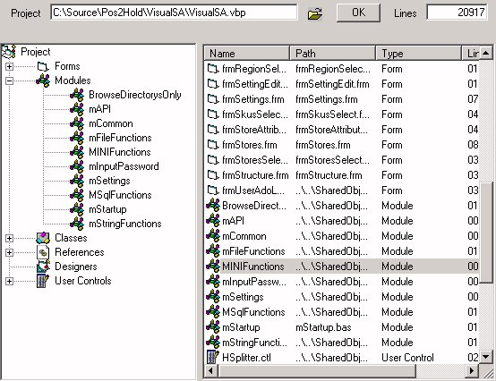



## Matthew's Project Explorer

### Description

Explores a VB project and displays the number of lines of code per object
 
### More Info
 
If you double click on the object in the list view, it will be opened with VB

a Graphical representation of the VB project and the number of lines

             |
---                |---
**Submitted On**   |2001-11-21 08:08:38
**By**             |[Matthew Saayman](https://github.com/Planet-Source-Code/PSCIndex/blob/master/ByAuthor/matthew-saayman.md)
**Level**          |Intermediate
**User Rating**    |5.0 (20 globes from 4 users)
**Compatibility**  |VB 6\.0
**Category**       |[Miscellaneous](https://github.com/Planet-Source-Code/PSCIndex/blob/master/ByCategory/miscellaneous__1-1.md)
**World**          |[Visual Basic](https://github.com/Planet-Source-Code/PSCIndex/blob/master/ByWorld/visual-basic.md)
**Archive File**   |[Matthew's\_3642311212001\.zip](https://github.com/Planet-Source-Code/matthew-saayman-matthew-s-project-explorer__1-29059/archive/master.zip)

### API Declarations

ShellExecute

